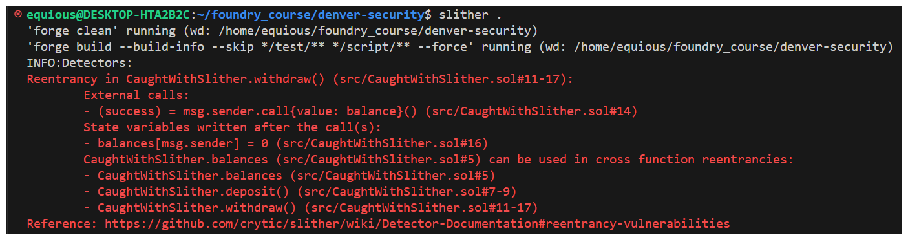
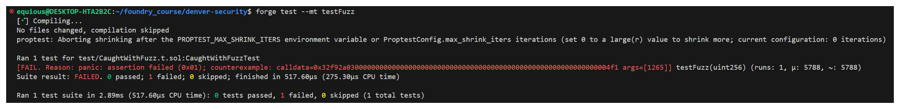
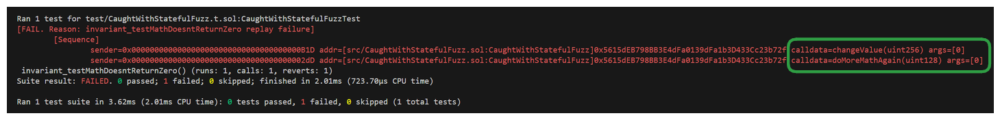
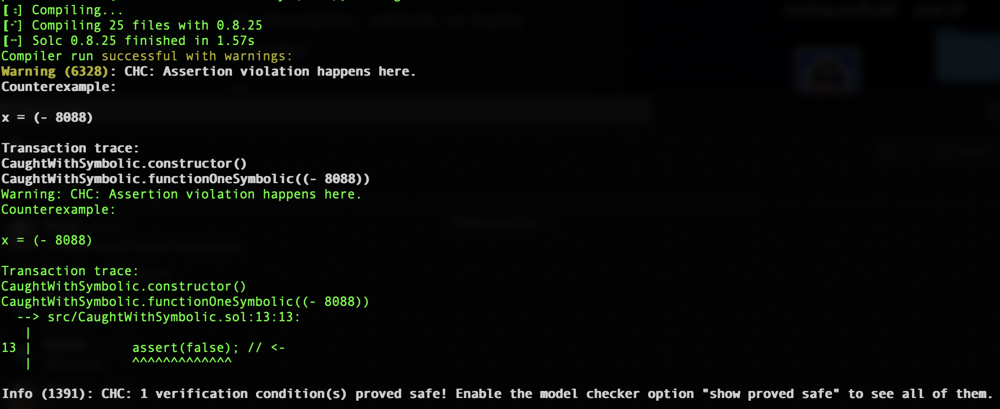

# Security & Auditing Introduction

## Cool resources:

* [rekt.news](https://rekt.news/), tracks crypto hacks and even has a leaderboard ranking the largest hacks of all time. What's so shocking (or not shocking) is how many of these hacked protocols went unaudited.

* [Solidity Security: Comprehensive list of known attack vectors and common anti-patterns](https://blog.sigmaprime.io/solidity-security.html): This site details a huge number of security vulnerabilities in this space that you should absolutely know about

* [Damn Vulnerable Defi](https://www.damnvulnerabledefi.xyz/): Gamified avenue to practice smart contract security and to experience attack vectors first hand

* [Ethernaut](https://ethernaut.openzeppelin.com/): OpenZeppelin offers another great gamified platform to learn smart contract vulnerabilities

* [Solodit](https://solodit.xyz/): An amazing platform that aggregates audit reports from the top auditors and firms in the industry. This is the place to see how it's done in the real world.

## What is a Smart Contract Audit?
A smart contract audit is a timeboxed, security based code review of a smart contract system.

An auditor's goal is to find as many security vulnerabilities as possible and educate the protocol on best practices moving forward in development. Auditors leverage a variety of tools and expertise to find these vulnerabilities.

*Why is a security audit so important?*
 With billions of dollars being stolen from unaudited code, the industry can't afford not to improve their security.

The immutability of the blockchain renders patching and updating frequently impossible, impractical or expensive. So having confidence in the security of your code is key.

An audit can actually accomplish much more than just checking for bugs. An audit can:

* Improve your developer team's understanding of code

* Improve developer speed and efficiency

* Teach the latest tooling

Often a single audit isn't even enough and protocols embark on a security journey including a number of steps like

* formal verification

* competitive audits

* Bug Bounty Programs

* Private Audits

* Mitigation Reviews

...and more.

There are lots of companies that offer Smart Contract Auditing services, such as:

[Trail of Bits](https://www.trailofbits.com/)

[Consensys Diligence](https://consensys.io/diligence/)

[OpenZeppelin](https://www.openzeppelin.com/security-audits)

[Cyfrin](https://www.cyfrin.io/)

So, what does a typical audit look like? Let's break it down into some steps.

1. Price and Timeline
A protocol has to reach out, either before or after their code is finished, but the more notice they can provide an auditor, the better. The protocol and auditor will discuss a number of details including:

   * Code Complexity

   * Scope

        * These are the exact files/commits that will be reviewed

   * Duration

        * This is largely dependent on how much code is in scope and how complex it is.

   * Timeline

You can read [CodeHawks Documentation](https://docs.codehawks.com/protocol-teams-sponsors/audit-pricing-and-timelines) for more clarity.

2. Commit Hash, Down Payment, Start Date

Once an auditor receives a commit hash, a start date and price can be finalized.

>❗ **_NOTE_**
A commit hash is the unique ID of the codebase being audited at a particular version in time.

Some auditors will ask for a down payment in order to schedule the audit.

3. Audit Begins* 

Auditors at this stage will use all their tricks and tools to find as many vulnerabilities in the code base as possible.

4. Initial Report

Once a review has been completed and auditor should provide an initial report detailing the vulnerabilities uncovered during the audit. These vulnerabilities are typically broken down into severity classifications:

* Highs

* Mediums

* Lows

* Informational/Non-Critical

* Gas Efficiencies

High/Medium/Low represents the impact and likelihood of each vulnerability.

Informational, Gas, and Non-Critical are findings to improve the efficiency of your code, code structure. Best practice and improvement suggestions are not vulnerabilities, but ways in which the code can be improved.

5. Mitigation Begins

At this phase the protocol team will often have an agreed upon period of time to mitigate the vulnerabilities identified in the initial report. Often much shorter than the audit itself, protocols will often be implementing the recommendations of the auditor within the received report.

6. Final Report

Sometimes referred to as a mitigation review, the auditing team will compile a final report based on only the fixes employed by the protocol team in the mitigation phase. This assures mitigations are implemented appropriately and that no new bugs have found their way in.

7. Post Audit

You should take the recommendations of your auditor(s) seriously, and if you make changes to your repo, that's now un-audited code. Once line being changed can be enough to wreck everything.

Hopefully the experience is positive for both the protocol and the auditor and they'll continue working together in the future.

As mentioned briefly, depending on the size or expected popularity of a protocol, often one audit won't be enough. Securing your code is an on going journey and just as your protocol evolves over time, so will your security needs.

Additionally, working with multiple auditors and having multiple eyes on your code can uncover even more vulnerabilities than a single review. This is one of the biggest advantages of a competitive audit platform.

If two heads are better than one, what are dozens or hundreds of heads capable of?

## Keys To a Successful Audit
There are a few things you as a developer can do to prepare for an audit to ensure things are successful and smooth.

1. Have clear Documentation

2. Robust test suite, ideally including fuzz tests

3. Code should be commented and readable

4. Modern best practices followed

5. Established communication channel between developer and auditors

6. Do an initial video walkthrough of the code

Stressing point 5 for a moment, The developers of a protocol are always going to have more context of a code base than an auditor will, having clear and efficient communication is important for allowing clear understanding of expected functionality and the ability to verify desired behaviour.

This clear understanding of what should happen is paramount. 80% of vulnerabilities found aren't broken code, but business logic.

### What an audit isn't
An audit is not a guarantee that your code is bug free.

Security is a continuous process that is always evolving with new vulnerabilities popping up each day. When/if an exploit hits your protocol, make sure you and your auditor have that line of communication to discuss the situation quickly.

## Top Tools used by Security Professionals

Being aware of the tools available in this space will even give you as developers the opportunity to employ them during development. Security isn't something you can just tack onto the end of a development cycle as is best approached as a foundational consideration from the very start of development.

A couple useful GitHub repos to consider:

* [solcurity](https://github.com/transmissions11/solcurity)

* [simple-security-toolkit](https://github.com/nascentxyz/simple-security-toolkit)

These are great avenues to ensure your protocol is ready for an audit. The latter even includes an [audit-readiness-checklist](https://github.com/nascentxyz/simple-security-toolkit/blob/main/audit-readiness-checklist.md) to help you prepare.

## The Audit Process
There's no silver bullet and each individual audit may be slightly different from the last, but here's a general outline of the process a protocol will undergo when under audit.

* Manual Review

    * Go through the Code & Docs

    * Understand what the protocol should do

* Using Tools

Manual Review is arguably the most important aspect of an audit. Reading the documentation and gaining context of the protocol and how it should behave. Taking the time to properly gain context can save a tonne of confusion later. Remember, most bugs are business logic related, meaning it isn't actually an error in the code that causes a problem, but some inaccurate implementation of what should happen.

For example:

```solidity
// SPDX-License-Identifier: MIT
​
pragma solidity ^0.8.18;
​
contract CaughtWithTest {
    uint256 public number;

    function setNumber(uint256 newNumber) public {
        number = newNumber + 1;
    }
}
```

Technically, there's nothing wrong with this code. It would only be through reading the documentation that you'd learn `setNumber` should set `number` to `newNumber` and not `newNumber + 1`.

## Tools
Let's talk about some of the tools security professionals and developers have in their toolbox.

1. **Test Suites**: This is the first line of defense. All of the most popular development frameworks include test suites, use them, use them often, catch those bugs.

2. **Static Analysis**: Static analysis is the process of checking code for issues without executing anything. Popular entries here include [Aderyn](https://github.com/Cyfrin/aderyn), [Slither](https://github.com/crytic/slither) and [Mithril](https://github.com/Consensys/mythril)

4. **Fuzz Testing**: a specific test suite methodology involving providing random data as inputs during testing.

Two variations exist including stateless and stateful fuzz testing. Stateless fuzz tests abandon the result of a previous test before running a new test, with a new contract state. Stateful, conversely will remember the ending state of one run and use this as the starting start for the next fuzz run.

4. **Differential Testing**: The idea is to write code in multiple ways and compare the results to each other to ensure validity.

5. **Formal Verification**: Formal Verification is a generic term for applying formal methods to verify the correctness of a system.

Applying formal methods pertains to anything based on mathematical proofs, these are mathematical expressions that solve for the soundsness and validity of a system, a proof of correctness, or whether or not a bug must exist. ie Symbolic Execution.

Examples of Formal Verification tools include [Manticore](https://github.com/trailofbits/manticore), [Halmos](https://github.com/a16z/halmos), [Certora](https://www.certora.com/prover) and even the `Solidity Compiler`.

There's a great article hosted by hackmd that compares many of these tools and how they work, you to [check it out](https://hackmd.io/@SaferMaker/EVM-Sym-Exec).

6. **AI Tools**: These can be hit or miss, but are absolutely evolving quickly. Any developer can find value in leveraging tools like Copilot, or state of the art models such as GPT4o, in their process.

### Testing Some Tools
Let's see a couple of tools in action. Take a look at the denver-security GitHub repo. Begin by cloning it locally.

```bash
git clone https://github.com/PatrickAlphaC/denver-security.git
code denver-security
```

To start with one the simpler onces, `CaughtWithManualReview.sol`, this bug is meant to be identified simply by reviewing the code manually.

```solidity
// SPDX-License-Identifier: MIT
pragma solidity ^0.8.13;
​
contract CaughtWithManualReview {
    /*
     * @dev adds 2 to numberToAdd and returns it
     */
    function doMath(uint256 numberToAdd) public pure returns(uint256){
        return numberToAdd + 1;
    }
​
    // We should write a test for every issue we find during manual review!
}
```
By reading the comments/documentation provided, we can see that this function is not behaving as expected.

Let's look at `CaughtWithTest.sol`.

```bash

// SPDX-License-Identifier: MIT
pragma solidity ^0.8.13;
​
contract CaughtWithTest {
    uint256 public number;
​
    function setNumber(uint256 newNumber) public {
        // Whoops, this isn't right!
        number = newNumber + 1;
    }
}
```
We expect the newNumber passed to this function would be assigned to our number state variable. A simple unit test would cast this one, no problem.

Next up, `CaughtWithSlither.sol`. We can use Slither, a static analysis tool to catch the issue here.

```solidity
// SPDX-License-Identifier: MIT
pragma solidity ^0.8.13;
​
contract CaughtWithSlither {
    mapping(address => uint256) public balances;
​
    function deposit() external payable {
        balances[msg.sender] += msg.value;
    }
​
    function withdraw() external {
        uint256 balance = balances[msg.sender];
        require(balance > 0);
        (bool success, ) = msg.sender.call{value: balance}("");
        require(success, "Failed to send Ether");
        balances[msg.sender] = 0;
    }
​
    function getBalance() external view returns (uint256) {
        return address(this).balance;
    }
}
```
Look at the exploit in this code, it's known as reentrancy, and it's a nightmare in Web3. You can read more about reentrancy and how it works [here](https://solidity-by-example.org/hacks/re-entrancy/).

>❗ **_PROTIP_**
Check out the installation instructions for Slither [here](https://github.com/crytic/slither), if you want to install it and try it yourself.

With Slither installed, you can run the command `slither .` and Slither will output all of the issues it detects in our code, right to the terminal.



Look how easy that is. It won't catch everything, but Slither is one of those tools everyone should run on their codebase before going to audit.

The `CaughtWithFuzz.sol` contract looks insane, but we have a clearly defined invariant, `should never return 0`.
```solidity
// SPDX-License-Identifier: MIT
pragma solidity ^0.8.13;
​
contract CaughtWithFuzz {
    /*
     * @dev Should never return 0
     */
    function doMoreMath(uint256 myNumber) public pure returns(uint256){
        if(myNumber == 7){
            return myNumber + 78;
        }
        if(myNumber == 1238 ){
            return myNumber + 2 ;
        }
        if(myNumber == 7225 ){
            return (myNumber / 78) + 1;
        }
        if(myNumber == 75 ){
            return (myNumber % 75) + 17 - (1*1);
        }
        if(myNumber == 725 ){
            return (myNumber / 2) + 7;
        }
        if(myNumber == 123 ){
            return (myNumber / 2) + 7;
        }
        if(myNumber == 1234 ){
            return (myNumber / 2) + 7;
        }
        if(myNumber == 12345 ){
            return (myNumber / 2) + 7;
        }
        if(myNumber == 1 ){
            return (myNumber / 2) + 10 - 1 * 5;
        }
        if(myNumber == 2 ){
            return (myNumber % 2) + 6 - 1 * 5;
        }
        if(myNumber == 1265 ){
            return (myNumber % 1265) + 1 - (1*1);
        }
        return 1;
    }
}
```
A clever fuzz test like this would have no issues catching vulnerabilities in a complex function as above:

```bash
// SPDX-License-Identifier: MIT
pragma solidity ^0.8.13;
​
import "../lib/forge-std/src/Test.sol";
import "../src/CaughtWithFuzz.sol";
​
contract CaughtWithFuzzTest is Test {
    CaughtWithFuzz public caughtWithFuzz;
​
    function setUp() public {
        caughtWithFuzz = new CaughtWithFuzz();
    }
​
    function testFuzz(uint256 randomNumber) public {
        uint256 returnedNumber = caughtWithFuzz.doMoreMath(randomNumber);
        assert(returnedNumber != 0);
    }
}
```
Running this test shows us clearly the power of a thorough fuzz testing suite.



Our fuzz test identifies the counter-example of 1265!

What about `CaughtWithStatefulFuzz.sol`? Well, in this contract a stateless fuzz test won't cut it. The invariant of `should never return zero` is only breakable through subsequent function calls to the contract, with the first altering contract in state, such that the second call breaks our invariant.

```solidity
// SPDX-License-Identifier: MIT
pragma solidity ^0.8.13;
​
contract CaughtWithStatefulFuzz {
    uint256 public myValue = 1;
    uint256 public storedValue = 100;
    /*
     * @dev Should never return 0
     */
    function doMoreMathAgain(uint128 myNumber) public returns(uint256){
        uint256 response = (uint256(myNumber) / 1) + myValue;
        storedValue = response;
        return response;
    }
​
    function changeValue(uint256 newValue) public {
        myValue = newValue;
    }
}
```

In the above, if changeValue is called with 0, and then doMoreMathAgain is also called with 0, invariant will break. We'll need a stateful fuzz suite to catch this one.
```solidity
// SPDX-License-Identifier: MIT
pragma solidity ^0.8.13;
​
import "forge-std/Test.sol";
import "forge-std/StdInvariant.sol";
import "../src/CaughtWithStatefulFuzz.sol";
​
contract CaughtWithStatefulFuzzTest is StdInvariant, Test {
    CaughtWithStatefulFuzz public caughtWithStatefulFuzz;
​
    function setUp() public {
        caughtWithStatefulFuzz = new CaughtWithStatefulFuzz();
        targetContract(address(caughtWithStatefulFuzz));
    }
​
    function testFuzzPasses(uint128 randomNumber) public {
        caughtWithStatefulFuzz.doMoreMathAgain(randomNumber);
        assert(caughtWithStatefulFuzz.storedValue() != 0);
    }
​
    function invariant_testMathDoesntReturnZero() public {
        assert(caughtWithStatefulFuzz.storedValue() != 0);
    }
}
```
We can see here the running our stateful fuzz test `invariant_testMathDoesntReturnZero` identifies the arguments to pass and order of functions to call which breaks our invariant.



Lastly, we have `CaughtWithSymbolic.sol` where we can actually just use the solidity compiler to try and catch some bugs.
```solidity
// SPDX-License-Identifier: MIT
pragma solidity ^0.8.13;
​
contract CaughtWithSymbolic {
​
    function functionOne(int128 x) public pure {
        if (x / 4 == -2022) {
            revert(); // BUG
        }
    }
​
    function functionOneSymbolic(int128 x) public pure {
        if (x / 4 == -2022) {
            assert(false);
            revert(); // BUG
        }
        assert(true);
    }
}
```

In solidity we can use `assert` statements to tell the compiler that something should, or shouldn't be the case at any given point of our code. In the above, we're saying that x/4 == -2022 should never be the case, as if the if conditional is satisfied, our assertion is true and the function reverts.

We're able to configure a number of details to provide the solidity compiler.

```toml
[profile.default.model_checker]
contracts = {'./src/CaughtWithSymbolic.sol' = ['CaughtWithSymbolic']}
engine = 'chc'
timeout = 1000
targets = ['assert']
```
By running `forge build` with these settings, we'll receive an output from our compiler, clearly indicating where the assertion is violated with a counter-example:



---

## Manual Review with an Expert

These are the key points to how one should do manual review of the code, this points are taken from a talk with Tincho. Tincho is a legend in Web3 security and is a member of [The Red Guild](https://theredguild.org/), a smart contract and EVM security firm. He was a previous lead auditor for the security firm at `OpenZeppelin`

#### 1. **Initial Setup**

* **Download code + read documentation first**
  → Understand context, jargon, intended functionality.
* Goal: Build intuition before diving into code.

#### 2. **Tools & Frameworks**

* **VS Codeium** → editor with privacy focus.
* **Foundry** → fast framework for testing + fuzzing.
* **CLOC** → count lines of code, gauge complexity.
* **Solidity Metrics (Consensys)** → analyze complexity & organization.
* Strategy: Start with smaller contracts → build up.

#### 3. **Mindset**

* Switch into **adversarial mode**:

  * “How can I break this?”
  * “Will this work for all tokens?” (e.g. USDT non-standard `transferFrom`)
  * “Is access control correct?”

#### 4. **Audit Process**

* **Iterative**: Audit → Review → Re-audit.
* **Take notes**:

  * Inline in code.
  * Separate file for raw notes/ideas.
* Avoid tunnel vision: regularly zoom out to full system view.
* Use **tests/fuzzing** to validate suspicions.

#### 5. **Communication**

* Keep **open communication** with protocol team.

  * They know intended behavior best.
  * Collaborate, but remain objective.

#### 6. **Time-Bounding**

* Auditing can be endless → **set time limits**.
* Be as thorough as possible within the bounds.

#### 7. **Audit Report**

* Deliver a **clear + concise report**:

  * List vulnerabilities.
  * Provide mitigation recommendations.
* Follow up to **verify fixes** don’t introduce new bugs.

#### 8. **On Missed Vulnerabilities**

* You won’t catch everything.
* Goal: Provide **value beyond just finding bugs** → educate, guide best practices.
* Responsibility is **shared** with the client.

#### 9. **Final Takeaway**

* Continuous learning, growth, and intuition matter most.
* "Do your best every day → experience builds skill."

---

## Layers of Testing and Formal Verification

### Layer 1: Unit Tests

These are the bare _minimum_ of testing in Web3 security. Unit test will propose a specific situation to our function and validate for us that this specific situation works as intended.

### Layer 2: Fuzz Tests
Fuzz tests are configured to have random inputs supplied to a function in an effort to identify and edgecase which breaks a protocol's invariant.

An invariant is a property of a protocol which much always hold true. Fuzz testing suites attempt to break these invariants with random data.

### Layer 3: Static Analysis
Unit testing and fuzz testing as examples of dynamic tests, this is when code is actually executed to determine if there's a problem.

Alternatively to this, we have static analysis as a tool available to us. In static analysis testing, a tool such as [Slither](https://github.com/crytic/slither) or [Aderyn](https://github.com/Cyfrin/aderyn), will review the code and identify vulnerabilities based on things like layout, ordering and syntax.
```solidity
function withdraw() external {
    uint256 balance = balances[msg.sender];
    require(balance > 0);
    (bool success, ) = msg.sender.call{value:balance}("");
    require(success, "Failed to send Ether");
    balances[msg.sender] = 0;
}
```
The above withdraw function has a classic reentrancy attack. We know an issue like this arises from not following the CEI pattern! A static analysis tool like Slither will be able to pick up on this quite easily.


### Layer 4: Formal Verification
At a high-level, formal verification is the act of proving or disproving a property of a system. It does this by generating a mathematical model of the system and using mathematical proofs to identify if a property can be broken.

There are many ways to perform formal verification including:

* Symbolic Execution

* Abstract Interpretation

* Model Checking

for more clarity about **Symbolic Execution** take a look at [this video](https://www.youtube.com/watch?v=yRVZPvHYHzw) by MIT OpenCourseWare

At a high-level, Symbolic Execution models each path in the code mathematically to identify if any path results in the breaking of an asserted property of the system.

```solidity
// SPDX-License-Identifier: MIT
pragma solidity ^0.8.16;
​
contract SmallSol {
    // Invariant: Must never revert.
    function f(uint256 a) public returns (uint256) {
        a = a + 1;
        return a;
    }
}
```
In the above simple contract example, the obvious path is returning the result of a + 1. Another less obvious path would be this function f reverting due to overflow. Symbolic Execution, through it's mathematical modelling, would traverse all possible paths, looking for criteria that break our invariant. These paths might be represented something like this:

**Path 1**: `assert(a not 2**256 - 1); a:= a+1; return a;`

**Path 2**: `assert(a := 2**256); revert;`

In the first path, a is anything less than uint256.max. In the second path, it's equal to the max and reverts.

Both of these situations can't simultaneously be true, so the formal verification solver would take the SMT-LIB code and determine which paths it's able to "satisfy". If path 2 can be satisfied, this represents a breaking of the protocol invariant/property.

>❗ **_NOTE_**
Formal verification tools use a special language to process the mathematical models of code called SMT_LIB.

Some formal verification tools available include things like Manitcore, Halmos and Certora, but even the Solidity Compiler can do many of these steps behind the scenes:

1. Explore Paths

2. Convert Paths to a set of Boolean expressions

3. Determine if paths are reachable

You can read more about the Solidity Compiler SMTChecker [here](https://docs.soliditylang.org/en/v0.8.26/smtchecker.html).

### Limitations of Formal Verification
Now, Formal Verification isn't a silver bullet, it does have its limitations. One of the most common of which is known as the **path explosion problem**. In essence, when a solver is presented with code that is non-deterministic or contains infinite looping, the number of possible paths approaches infinity. When this happens, a solver is unable to resolve a valid proof due to the time and computation necessary to solve.

---

## Isolated Development Environments
According to Chain Analysis, in 2024 the most popular type of attack was a private key leak.

Isolated Environments  mitigate the risks of running malicious code on our host machine.

To Protect our host machine against different attack vectors which all have one thing in common, running unvetted code on our host machine and giving it access to everything.

The tool that can be used to isolate the unvetted code is Docker containers or Dev containers, specifically Dev containers built directly into VS Code.

Let’s imagine our computer has hardware, and a host operating system such as Linux, MacOS, or Windows, Inside this OS contains network, files and our applications.

If we run a script in our host machine with npm run, or bash script, it has access to our network, files and applications.

### Setting up a Dev Container

1. Clone the repo
2. Make sure docker is running

3. In VS Code open the command pallet and select:

```bash
reopen in container
```

4. We can view that the container is running in the docker desktop app

Dev containers allow us to see a folder called `.devcontainer` which has the following:

* `devcontainer.json`

* `dockerfile`

The dockerfile tells docker what tools to install and how to spin up a docker container.

Our docker file for the foundry folder is set to start from a blank Linux Debian instance. Some of the tools this docker will install are ZSH, Rust, UV, some solidity tools, and foundry.

There are workspace mount settings on the container, which tells VS Code to spin up an unmounted Docker container. This is where you must be specific with what access you give the container. To check where our directory is we can run the following command in the terminal:

```bash
pwd
```
It says we are in the /workspaces directory.

Inside of VSCode if we open a terminal and then run a `git clone` command on a github repository it will clone this code and run inside of the docker container. We can open this new directory with a code command:

```bash
code .
```
Here are some quick tips:

* Its always dangerous to run code you are not 100% sure of

* Running scripts in isolated environments like Docker containers can help protect against unknown malicious scripts

* There is no 100% sure way to be 100% safe
